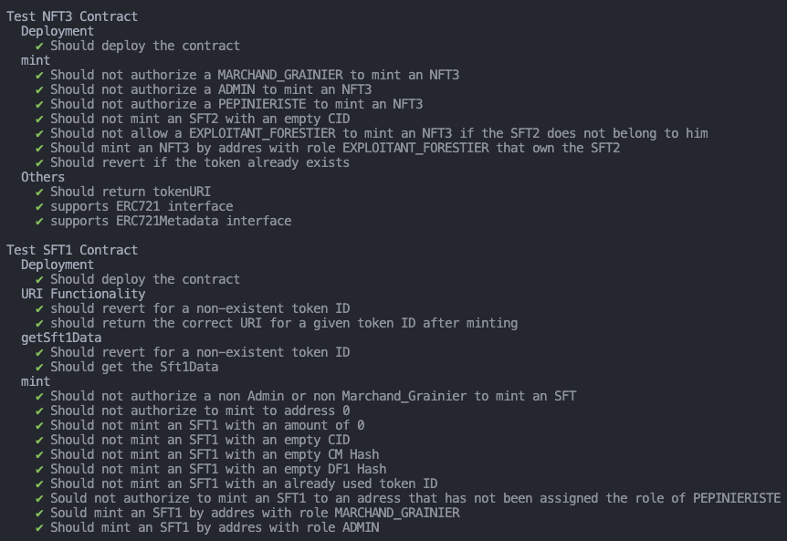
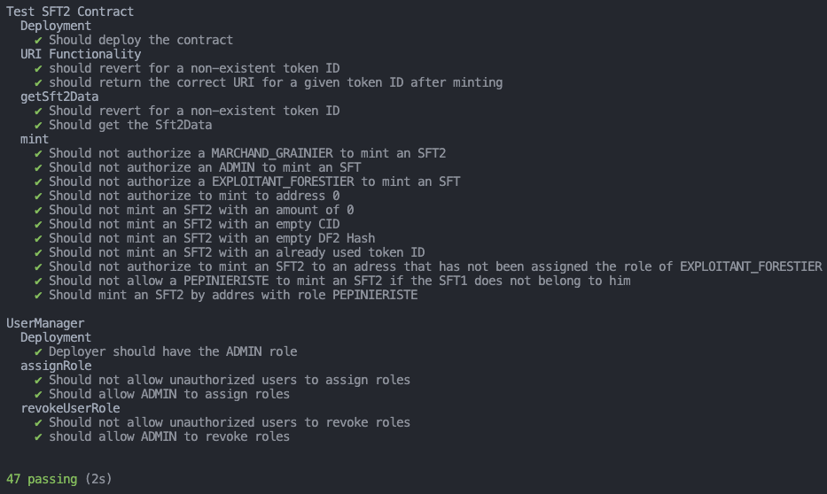
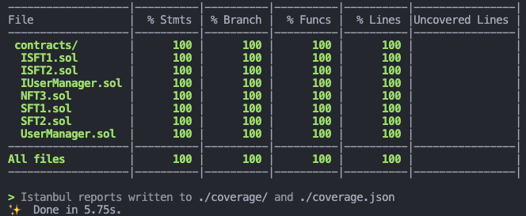

<h1 align="center">FORMATION ALYRA - PROJET FINAL POUR CERTIFICATION RS5000</h1>
<h1 align="center">Tree Tracker : Solution de traçabilité de la graine à la plantation de l'arbre</h1>
<h2 align="center" style="color:#AEFAFA;">Nino GUÉGUEN - Promo Lovelace (2024)</h2>

---

## Liens utiles

- Lien vers l'application déployée : https://agroforestery-project.vercel.app/
- Lien vidéo de démo : https://www.loom.com/share/974d2a96518946ec9ffd75a6f8d54ce1?sid=c74a8001-34d3-485e-b313-3e655cce5872
- Lien Smart Contract [UserManager.sol](https://sepolia.etherscan.io/address/0xDa1A6F223da2389E470F6Da6f56B107CBaF9e2C1#code)
- Lien Smart Contract [SFT1.sol](https://sepolia.etherscan.io/address/0xE9D1D106FC5F7a7Ca37DFF254fC0758cE7aA6e88#code)
- Lien Smart Contract [SFT2.sol](https://sepolia.etherscan.io/address/0x9712641545adF54146b6992e7F9F72205cf6DdAE#code) 
- Lien Smart Contract [NFT3.sol](https://sepolia.etherscan.io/address/0xd953E34cb7e86B307d8d661d8bd4f17eE7B8DBd6#code)

## Table des Matières

- [Introduction](#introduction)
- [Problématique](#problématique)
- [Objectifs du Projet](#objectifs-du-projet)
- [Technologies Utilisées](#technologies-utilisées)
- [Structure du Projet](#structure-du-projet)
  - [Front-End](#front-end)
  - [Back-End](#back-end)
  - [Smart Contracts](#smart-contracts)
- [Démonstration de Compétences](#démonstration-de-compétences)
  - [C1: Conception du Projet](#c1-conception-du-projet)
  - [C2: Développement Front-End](#c2-développement-front-end)
  - [C3: Développement Back-End](#c3-développement-back-end)
  - [C4: Conception de Smart Contract](#c4-conception-de-smart-contrat)
  - [C5: Développement de Smart Contract](#c5-développement-de-smart-contract)
  - [C6: Tests Fonctionnels](#c6-tests-fonctionnels)
  - [C7: Déploiement](#c7-déploiement)
- [Guide d'Installation et de Démarrage](#guide-dinstallation-et-de-démarrage)
- [Contribuer au Projet](#contribuer-au-projet)
- [Licence](#licence)

## Introduction

L'agroforesterie représente un domaine d'une importance cruciale pour notre avenir environnemental et économique. À travers le projet de notre équipe, composée de Pascal, expert en forêt et reforestation, Olivier, spécialiste de l'environnement et des projets participatifs, Thomas, chef de projet en architecture logicielle et GIS, et moi-même, développeur, nous avons cherché à répondre à des enjeux majeurs de notre époque. Notre projet trouve son origine dans une passion commune pour l'environnement et l'agriculture, et nous l'avons développé notamment dans le cadre du plan de relance national de reboisement en France, qui vise à planter 45 000 hectares de forêts pour capter 150 000 tonnes de CO2 supplémentaires chaque année.

La vision de Pascal sur les problématiques spécifiques de l'agroforesterie a été le catalyseur de notre initiative, nous amenant à envisager la création d'un outil de traçabilité de la graine jusqu'à la plantation. Ce projet se veut une réponse aux défis de notre temps, combinant innovation technologique et engagement environnemental.

## Problématique

La traçabilité dans l'agroforesterie est confrontée à des problématiques majeures, incluant le trafic et les fraudes autour des échanges de graines, une traçabilité quasi inexistante, et l'usage de systèmes de suivi obsolètes et falsifiables comme Excel. À cela s'ajoutent des défis liés à l'attribution de fonds publics pour la reforestation, où les contrôles restent opaques et souvent inadaptés aux besoins environnementaux réels.

Notre projet se propose donc de développer une solution blockchain offrant une traçabilité transparente, sécurisée, et indélébile de la graine à la plantation, tout en facilitant une attribution équitable et transparente des subventions publiques pour la reforestation. Cette approche vise à remédier aux problèmes de trafic, de fraudes, et à l'inadaptation des outils de suivi actuels, contribuant ainsi à une gestion plus durable et responsable des ressources forestières.

Ce projet incarne notre engagement envers une gestion environnementale plus responsable et témoigne de notre volonté de contribuer à des initiatives de reforestation plus transparentes et efficaces.

## Objectifs du Projet

1. **Améliorer la Traçabilité** : Développer un système sécurisé et transparent pour suivre le parcours de la graine jusqu'à la plantation, en combattant les fraudes et le trafic illégal.
   
2. **Faciliter la Gestion des Subventions** : Mettre en place un mécanisme clair et transparent pour l'attribution des fonds publics destinés à la reforestation, afin d'assurer une distribution équitable et efficace.

3. **Optimiser les Outils de Suivi** : Remplacer les outils de gestion désuets par une solution blockchain offrant une fiabilité et une intégrité des données inégalées, grâce à une DApp accessible et facile à utiliser.

4. **Contribuer à l'Environnement** : Aider à la réalisation des objectifs environnementaux en facilitant la plantation de 45 000 hectares de forêts, ce qui permettra de capter 150 000 tonnes de CO2 supplémentaires chaque année.

5. **Encourager l'Innovation** : Préparer le terrain pour le développement futur, notamment la création d'une DAO, en anticipant les besoins à long terme du secteur de l'agroforesterie.

## Technologies Utilisées

- **Solidity** : Langage de programmation conçu pour le développement de smart contracts sur les blockchains liées à Ethereum, essentiel pour établir une base sécurisée et transparente de traçabilité.

- **Hardhat** : Un environnement de développement robuste qui facilite le test, le déploiement et la gestion des smart contracts, offrant une expérience de développement cohérente et efficace.

- **React avec Next.js** : Un cadre de travail puissant pour la construction de l'interface utilisateur (UI) de notre application décentralisée (DApp), garantissant une interaction fluide et intuitive pour les utilisateurs.

- **ChakraUI** : Bibliothèque de composants UI pour React qui permet de créer rapidement une interface attrayante et réactive, améliorant l'expérience utilisateur de notre DApp.

- **RainbowKit** : Solution intégrée pour la connexion aux wallets de cryptomonnaies, simplifiant les interactions des utilisateurs avec la blockchain depuis l'interface de la DApp.

- **ethers.js** : Bibliothèque légère et complète pour interagir avec la blockchain et les smart contracts, utilisée pour les communications entre notre application front-end et les contrats intelligents.

- **Wagmi** : Un ensemble d'hooks React, qui rend l'interaction avec la blockchain plus accessible et facile à gérer, en particulier pour le développement de composants front-end qui nécessitent une interaction avec la blockchain (écriture et lecture des fonctions puis récupération des events (logs)).

- **IPFS (InterPlanetary File System)** : Système de fichiers décentralisé utilisé pour le stockage et le partage de fichiers dans un environnement blockchain, garantissant que les documents et certificats liés aux échanges sont stockés de manière sécurisée et persistante.

- **Alchemy** : Plateforme de développement blockchain qui fournit un accès direct et fiable à la blockchain, essentielle pour le déploiement efficace et la gestion des interactions avec nos smart contracts.

## Structure du Projet

### Front-End
Le Front-End de notre DApp est construit avec React et Next.js, offrant une expérience utilisateur fluide et réactive. L'interface utilisateur est conçue pour être intuitive, permettant aux utilisateurs de facilement naviguer à travers les différentes fonctionnalités telles que l'enregistrement des échanges de graines, le suivi des plants jusqu'à la plantation, et la consultation des données de traçabilité. ChakraUI est utilisé pour le design, assurant que l'application soit accessible et esthétiquement agréable, tandis que RainbowKit facilite l'intégration des wallets des utilisateurs, permettant une interaction sécurisée avec la blockchain. Wagmi est employé pour simplifier l'interaction avec la blockchain, rendant le développement plus efficace et convivial.

### Back-End
Le Back-End se concentre sur la logique des smart contracts développés en Solidity et interagit avec la blockchain sepolia (tesnet d'Ethereum). Hardhat est utilisé comme environnement de développement pour compiler, tester, et déployer les smart contracts. Ceux-ci incluent la logique pour la création et le suivi des tokens ERC-1155 pour les échanges de graines et de jeunes plants, ainsi que les tokens ERC-721 pour la plantation individuelle des arbres. Les smart contracts gèrent également les rôles et les permissions des différents acteurs impliqués dans le processus, garantissant que chaque transaction soit sécurisée et transparente.

### Smart Contracts
Les smart contracts sont au cœur de notre solution, permettant la traçabilité inaltérable de la graine à la plantation. Ils sont conçus pour :

- **Gestion des Utilisateurs** : Un contrat pour gérer les différents rôles (par exemple, marchand grainier, pépiniériste, exploitant forestier) et les permissions dans l'écosystème.

- **Échange de Graines (ERC-1155)** : Contrats pour représenter les échanges de lots de graines et de jeunes plants, utilisant le standard ERC-1155 pour une flexibilité maximale.

- **Plantation d'Arbres (ERC-721)** : Un contrat pour représenter la plantation individuelle des arbres, utilisant le standard ERC-721 pour garantir l'unicité et la traçabilité de chaque arbre planté.

- **Intégrité des Données** : Utilisation de l'IPFS pour stocker les documents et certificats liés aux transactions, assurant la pérennité et l'intégrité des données.

## Démonstration de Compétences

Notre projet illustre une approche globale dans le développement d'applications blockchain, démontrant des compétences techniques et conceptuelles à chaque étape. Voici comment nous avons répondu aux compétences spécifiées :

### C1: Conception du Projet

La conception du projet a débuté par une analyse approfondie des besoins liés à l'agroforesterie, menant à l'élaboration d'un système de traçabilité de la graine à la plantation. Nous avons défini le périmètre de l'application, identifié les utilisateurs cibles et leurs besoins, et sélectionné les technologies et outils adéquats. Le schéma fonctionnel de l'application a été développé pour illustrer les flux de données et interactions entre les différents composants du système.

### C2: Développement Front-End

Pour le Front-End, nous avons utilisé React et Next.js, créant une interface utilisateur riche et intuitive. ChakraUI a été choisi pour le design, tandis que RainbowKit et Wagmi ont facilité l'intégration des wallets des utilisateurs et l'interaction avec la blockchain. Le dashboard permet aux utilisateurs de suivre les échanges de graines et la progression des plantations en temps réel.

### C3: Développement Back-End

Le Back-End repose sur Solidity pour le développement des smart contracts qui orchestrent la logique d'échange de graines et de plants, ainsi que la plantation d'arbres. Hardhat a servi à l'environnement de développement, permettant le déploiement, le test et la gestion des smart contracts. L'intégration avec l'IPFS assure le stockage sécurisé et la récupération des documents liés.

### C4: Conception de Smart Contract

La conception des smart contracts a été guidée par la nécessité de sécuriser et d'optimiser les transactions. Nous avons utilisé Solidity pour créer des contrats intelligents respectant les standards ERC-1155 et ERC-721, permettant une traçabilité détaillée et une représentation fidèle des échanges et des plantations.

### C5: Développement de Smart Contract

Les smart contracts ont été développés pour garantir la sécurité, l'efficacité et la conformité avec les besoins du projet. Nous avons implémenté des mécanismes de gestion des rôles, de création de tokens pour les échanges et de suivi des plantations, tout en assurant l'intégrité et la non-falsifiabilité des données grâce à l'IPFS.

### C6: Tests Fonctionnels

Les tests fonctionnels ont été réalisés en utilisant Hardhat et Chai pour s'assurer que chaque smart contract fonctionne comme prévu. Une couverture de test à 100% a été atteinte, validant la logique contractuelle, la sécurité des transactions et la conformité des fonctionnalités développées.

### C7: Déploiement

Le déploiement a inclus la mise en place du Front-End sur Vercel et des smart contracts sur la blockchain Sepolia, utilisant Alchemy comme passerelle. Des scripts de déploiement spécifiques ont été conçus pour faciliter la mise en production, s'assurant que l'application est opérationnelle et accessible pour le jury et les utilisateurs finaux.

## Guide d'Installation et de Démarrage

Bienvenue sur notre application de traçabilité agroforestière déployée sur Vercel. Cette plateforme vous permet de suivre le parcours de la graine jusqu'à la plantation d'un arbre, assurant une traçabilité transparente et sécurisée à chaque étape. Pour accéder et utiliser l'application, veuillez suivre les instructions ci-dessous.

Lien de l'application décentralisée : https://agroforestery-project.vercel.app/

### Prérequis

- **Wallet MetaMask** : Avoir un wallet MetaMask installé sur votre navigateur est indispensable pour interagir avec notre application décentralisée (DApp).
- **Accès à l'Application** : Pour obtenir les accès nécessaires, veuillez envoyer un email à ninogueguen@gmail.com
- **Fichiers Exemples** : Récupérez les fichiers exemples nécessaires pour les transactions à partir de `backend/data/Exemple1`.

### Utilisation de l'Application

L'application est accessible directement via un navigateur web à l'adresse fournie après votre demande d'accès. Voici comment naviguer dans l'application :

- **Vue n°1 : Historiques des Transactions**
  - Visualisez l'historique complet des transactions effectuées sur la plateforme.

- **Vue n°2 : Étape 1 - Échange entre le Marchand Grainier et le Pépiniériste**
  - **Inputs** : Fichier JSON et PDF des certificats maître et du document du fournisseur 1.
  - Cliquez sur "Préparer les Métadonnées".
  - Renseignez l'adresse du pépiniériste qui recevra les graines.
  - Cliquez sur "Minter le SFT1".

- **Vue n°3 : Étape 2 - Échange entre le Pépiniériste et l'Exploitant Forestier**
  - **Inputs** : Fichier JSON et PDF du document du fournisseur 2 et numéro du SFT1 associé. Le pépiniériste doit posséder le SFT1 pour initier la transaction.
  - Cliquez sur "Préparer les Métadonnées".
  - Renseignez l'adresse de l'exploitant forestier qui recevra les plants.
  
- **Vue n°4 : Étape 3 - Plantation des Arbres par l'Exploitant Forestier**
  - **Inputs** : Numéro du SFT2 associé (l'exploitant forestier doit posséder le SFT2) et image de l'arbre planté.
  - Renseignez la latitude et longitude de la plantation.
  - Cliquez sur "Préparer les Métadonnées" puis sur "Minter le NFT3".

- **Page utilaitaire : Gestion des Utilisateurs (accès uniqument aux Administrateurs)**
  - **Inputs** : Adresse de l'utilisateur et sélection du rôle qu'on souhiate lui associer
  - Cliquez sur "Ajouter l'utilisateur" pour enregistrer l'utilsateur et sonrôle dans le smatrt contract associé.

### Conseils d'Utilisation

- Veillez à bien suivre chaque étape pour garantir une traçabilité sans faille des échanges et de la plantation.
- Pour toute question ou assistance technique, n'hésitez pas à contacter l'équipe de développement via l'email fourni.

En utilisant notre application, vous contribuez à une initiative de reforestation transparente et sécurisée, promouvant la durabilité et l'intégrité environnementale. Merci de participer à ce projet innovant.

## Contribuer au Projet

Nous accueillons et apprécions les contributions de tous ceux qui souhaitent améliorer et étendre les fonctionnalités de notre application de traçabilité agroforestière. Que vous soyez un développeur, un spécialiste de l'agroforesterie, ou simplement passionné par le développement durable, voici comment vous pouvez contribuer :

- **Signaler des Bugs** : Si vous rencontrez un bug ou un problème technique, veuillez ouvrir un ticket dans notre système de suivi des problèmes sur GitHub. Fournissez une description détaillée du problème pour nous aider à le résoudre rapidement.

- **Proposer des Améliorations** : Des idées pour de nouvelles fonctionnalités ou des suggestions pour améliorer l'application ? Partagez-les avec nous via GitHub ou par email.

- **Participer au Développement** : Les développeurs peuvent contribuer directement en soumettant des pull requests. Avant de soumettre, veuillez vous référer à notre guide de contribution pour les conventions de codage et les processus de revue de code.

Pour commencer, veuillez consulter notre dépôt GitHub à l'adresse suivante : [https://github.com/NinoGG1/Agroforestery-Project](https://github.com/NinoGG1/Agroforestery-Project). Vous y trouverez toutes les informations nécessaires, y compris la documentation du projet, le guide de contribution, et la liste des tâches ouvertes.

## Licence

Ce projet est distribué sous la licence MIT, qui permet une grande liberté d'utilisation, de modification, et de distribution, tout en nécessitant que le même niveau de liberté soit préservé dans les versions dérivées du logiciel.

La licence MIT est choisie pour encourager une adoption et une collaboration larges, permettant à quiconque de contribuer au projet tout en bénéficiant de la transparence et de l'ouverture. Pour plus d'informations sur les termes et conditions, veuillez consulter le fichier `LICENSE` situé à la racine de notre dépôt GitHub.

En contribuant au projet, vous acceptez de respecter les principes de la licence et de contribuer de manière éthique et respectueuse à la communauté qui entoure ce projet.
